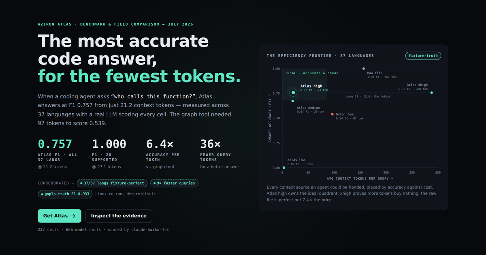
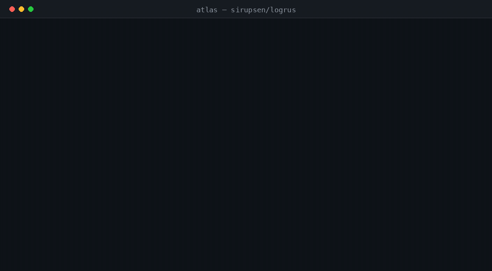

<p align="center">
  <a href="https://aziron-ai.github.io/atlas/">
    
  </a>
</p>

<h1 align="center">Atlas</h1>

<p align="center">
  <strong>Stop pasting your codebase into the context window.</strong><br>
  Atlas gives you and your AI coding agent precise, <code>file:line</code>-cited answers about
  your code — who calls what, what breaks if this changes, which routes depend on a
  handler — for a fraction of the tokens it takes to read the files.
</p>

<p align="center">
  <a href="https://github.com/aziron-ai/atlas/releases"></a>
  <a href="LICENSE"></a>
  
  
  <a href="https://aziron-ai.github.io/atlas/#benchmarks"></a>
</p>

<p align="center">
  <a href="https://aziron-ai.github.io/atlas/#docs/getting-started">Documentation</a> ·
  <a href="https://aziron-ai.github.io/atlas/#docs/installation">Install</a> ·
  <a href="https://github.com/aziron-ai/atlas/releases">Releases</a> ·
  <a href="https://aziron-ai.github.io/atlas/#benchmarks">Benchmarks</a> ·
  <a href="https://github.com/aziron-ai/atlas/wiki">Wiki</a>
</p>

<p align="center">
  
</p>

<p align="center">
  ⭐ <strong>If Atlas saves your agent tokens (or your patience), a star helps others find it.</strong>
</p>

---

## Why Atlas

Coding agents answer code questions the expensive way: grep, then read whole
files into the context window, then guess. It burns tokens, dilutes the model's
attention, and still misses callers in files it never opened.

Atlas indexes your repo once and answers structural questions directly —
definitions, callers, references, routes, and change impact — returning a small,
**cited** slice of code instead of the whole file. Every answer points to
`file:line`, so you (or the agent) can verify the evidence.

It runs **locally**, is **deterministic** (no LLM in the loop, so the tool itself
spends zero tokens), and plugs into Claude, Codex, Cursor, Gemini, and Copilot
over MCP.

## The numbers

Measured on a public benchmark — 222 cells, 666 real LLM-scored model calls,
across 37 languages. Full methodology and raw artifacts are
[published and reproducible](https://aziron-ai.github.io/atlas/#benchmarks).

| Approach | Answer accuracy (F1) | Context tokens / query |
| --- | --- | --- |
| Read the whole file *(accuracy ceiling)* | 1.00 | 157 |
| Graph tool | 0.54 | 97 |
| **Atlas** | **0.76** — and **1.00 on 28 languages** | **21** |

<p align="center">
  <strong>+40%</strong> answer accuracy &nbsp;·&nbsp;
  <strong>36×</strong> fewer query tokens &nbsp;·&nbsp;
  <strong>17×</strong> faster queries &nbsp;·&nbsp;
  <strong>2.3×</strong> faster cold index
</p>

On its 28 supported languages Atlas matches the *raw-file accuracy ceiling*
(F1 1.00) while using **~6× fewer tokens** — and answers `who calls X` in a
**~7 ms median** even on symbols with tens of thousands of callers.

### Why not just read the files?

Ask **"who calls `WithField`?"** on [sirupsen/logrus](https://github.com/sirupsen/logrus),
scored against `gopls` call-hierarchy as ground truth:

| Approach | Tokens into the model | Accuracy (F1) |
| --- | ---: | ---: |
| Dump the raw files | 2,227 | 0.02 |
| Graph tool | 98 | 0.08 |
| **Atlas** | **169** | **0.98** |

A production function has callers spread across many files; raw dumps drown the model
in noise and still miss callers. Atlas returns the complete, precise caller set as
structured, cited context — **~13× fewer tokens and far more accurate.**

And it compounds across a real agent loop. On the same repo, 19 questions, Claude:

| Mode | Total tokens | Turns | Answer F1 | Wall time |
| --- | ---: | ---: | ---: | ---: |
| Grep-and-read baseline | 144,385 | 4.9 | 0.57 | 19.9 s |
| **With Atlas** | **61,561** | **2.0** | **0.88** | **8.3 s** |

## Quickstart

Install with Homebrew:

```sh
brew install --cask aziron-ai/atlas/atlas
```

…or the npm wrapper:

```sh
npm install -g @aziron/atlas
```

Index a repository and wire Atlas into your coding assistants:

```sh
cd /path/to/repository
atlas index .
atlas bootstrap --dry-run   # preview assistant config changes
atlas bootstrap             # register MCP integrations
atlas status
```

That's it. Atlas can now answer questions like:

```sh
atlas search "checkout flow" --format plain   # where is it implemented?
atlas symbol CreateOrder                       # definition + callers + callees
atlas callers CreateOrder --limit 25           # who calls it?
atlas impact --paths services/cart.go          # what breaks if this changes?
```

The same answers are available to your coding assistant through Atlas's MCP
tools — with `file:line` citations on every result.

See [Getting Started](https://aziron-ai.github.io/atlas/#docs/getting-started)
for a guided first index and first query.

## What Atlas provides

| Task | Capability |
| --- | --- |
| Find relevant code | Code-aware search and bounded context |
| Understand a symbol | Definitions, callers, callees, and references |
| Review a change | Repository and cross-repository impact analysis |
| Trace service dependencies | Routes, consumers, and dependencies |
| Support coding agents | MCP tools with source and line citations |
| Operate a local index | CLI status, dashboard, and HTTP API |

Atlas runs locally by default and stores its index in the repository workspace.
No server is required for local indexing, CLI queries, or stdio MCP usage.

## Interfaces

- the `atlas` command-line interface
- MCP integrations for **Claude, Codex, Cursor, Gemini, and GitHub Copilot**
- a local dashboard and HTTP API
- release archives and native Linux packages

Integration behavior varies by client — follow
[AI Assistant Setup](https://aziron-ai.github.io/atlas/#docs/assistants)
for supported configurations.

## Install matrix

| Channel | Platforms |
| --- | --- |
| Homebrew cask | macOS and Linux, amd64 and arm64 |
| npm `@aziron/atlas` | macOS/Linux x64 and arm64; Windows x64 |
| Release archives | macOS/Linux amd64 and arm64; Windows amd64 |
| Linux packages | `.deb`, `.rpm`, and `.apk` for amd64 and arm64 |

Homebrew and npm installs run `atlas bootstrap` to register supported local
assistant integrations. Preview first with `atlas bootstrap --dry-run`, or skip
it in automation:

```sh
ATLAS_SKIP_BOOTSTRAP=1 npm install -g @aziron/atlas
```

Checksums and per-archive SBOMs are attached to every
[GitHub release](https://github.com/aziron-ai/atlas/releases).

## Documentation

- [Getting Started](https://aziron-ai.github.io/atlas/#docs/getting-started)
- [Installation](https://aziron-ai.github.io/atlas/#docs/installation)
- [Indexing and Reindexing](https://aziron-ai.github.io/atlas/#docs/indexing)
- [CLI Reference](https://aziron-ai.github.io/atlas/#docs/cli)
- [AI Assistant Setup](https://aziron-ai.github.io/atlas/#docs/assistants)
- [MCP Tools](https://aziron-ai.github.io/atlas/#docs/mcp)
- [Dashboard and HTTP API](https://aziron-ai.github.io/atlas/#docs/service)
- [Configuration](https://aziron-ai.github.io/atlas/#docs/configuration)
- [Privacy and Data Handling](https://aziron-ai.github.io/atlas/#docs/privacy)
- [Supported Languages](https://aziron-ai.github.io/atlas/#docs/languages)
- [Benchmarks and Methodology](https://aziron-ai.github.io/atlas/#docs/benchmarks)
- [Troubleshooting](https://aziron-ai.github.io/atlas/#docs/troubleshooting)

The complete guide is also mirrored in the
[GitHub Wiki](https://github.com/aziron-ai/atlas/wiki).

## Benchmarks and data

The [benchmark explorer](https://aziron-ai.github.io/atlas/#benchmarks) presents
dated accuracy, token-use, and latency measurements with limitations and
evidence levels. The underlying data is downloadable:

- [Processed site data](data/site-data.json)
- [Raw benchmark artifacts](data/raw/)
- [Agent benchmark reproduction guide](agent-bench/README.md)

Results describe the published test conditions and are not a guarantee for every
repository, language, machine, or coding assistant.

## Data handling

Indexing and querying run locally by default. An MCP client or coding assistant
may send the snippets it receives to its configured model provider, subject to
that client's data policy. Network listeners and optional connected features
require additional configuration. Review
[Privacy and Data Handling](https://aziron-ai.github.io/atlas/#docs/privacy)
before enabling network access or organization-connected features.

## Star History

<a href="https://www.star-history.com/#aziron-ai/atlas&Date">
  
</a>

## Repository scope

This public repository distributes Atlas release binaries, consumer
documentation, the benchmark site, and downloadable benchmark artifacts. The
Atlas CLI source tree is not published here.

## License

Atlas is distributed under the [Apache License 2.0](LICENSE).
